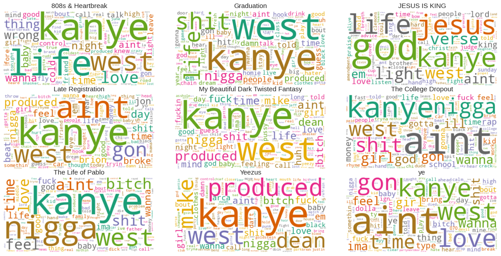
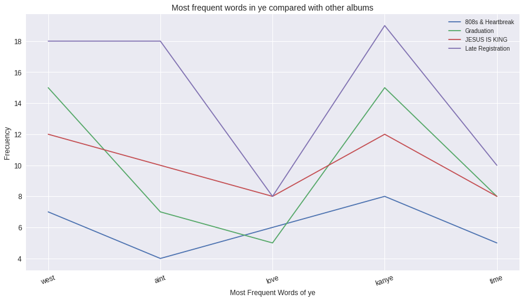

# Kanye-Analysis

#### why/what/how

I'm looking for the most used words throughout KanyeWest's discography and plotting them to a word cloud graph.

What I've done is downloaded Kanye West's whole discography (mostly lyrics) using the lyricsgenius python library. What is returned from this
library is a json file containing raw lyrics. Next we parse the lyrics throwing out [stop words](https://en.wikipedia.org/wiki/Stop_word).

Now that we have the data processed we can finally plot our data that we have found.

